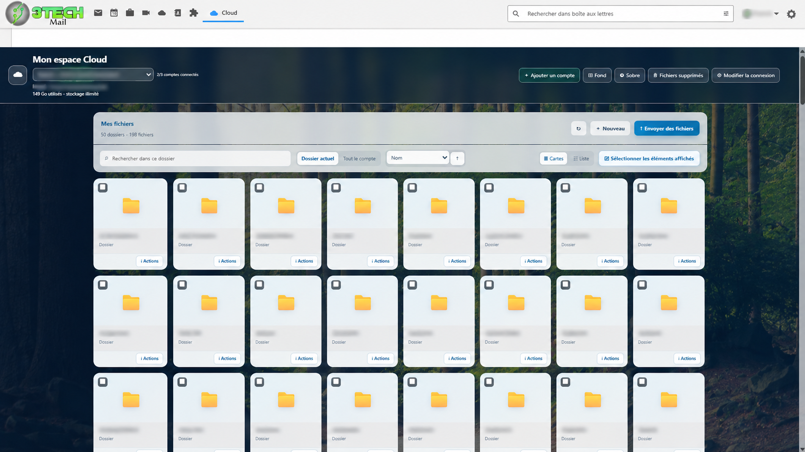
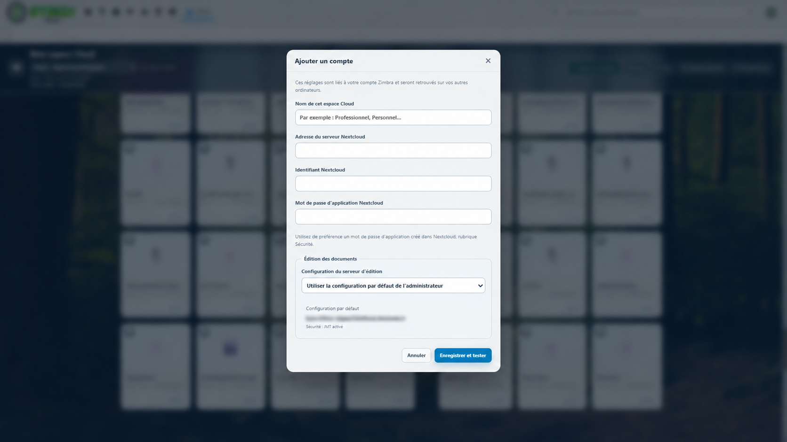
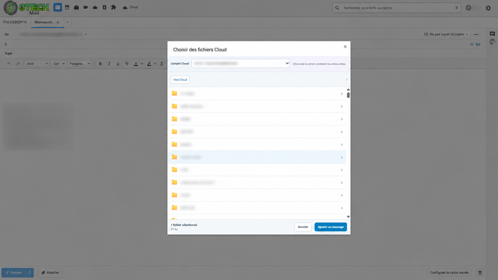
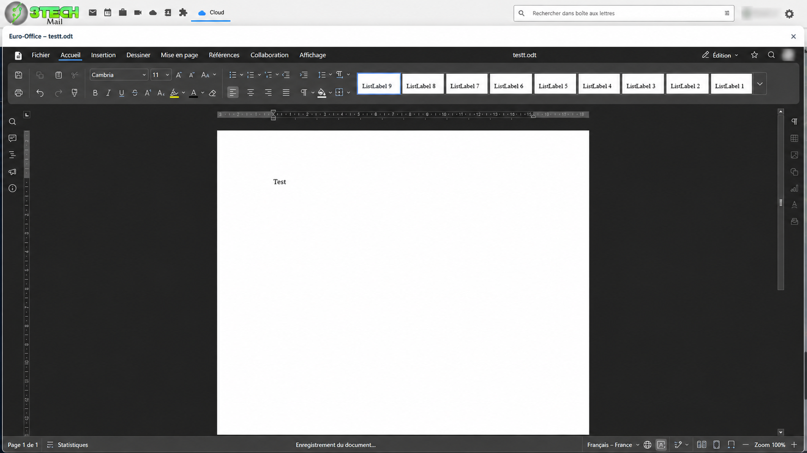
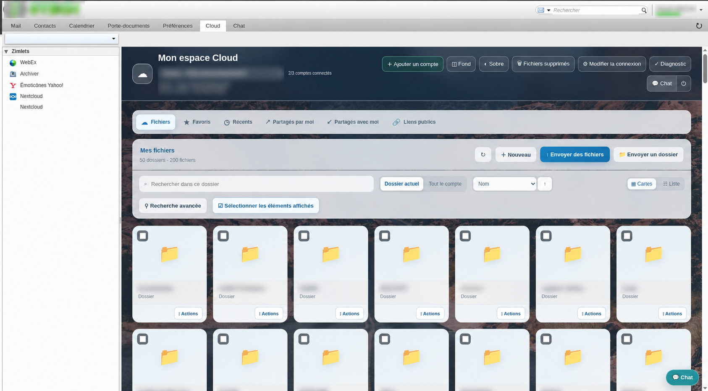
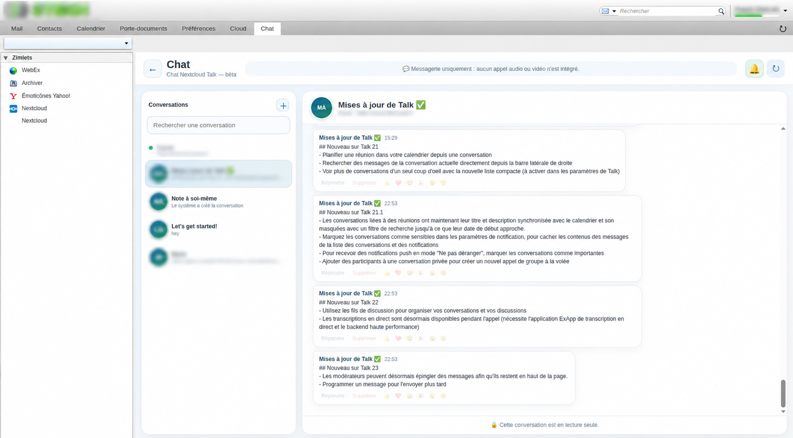
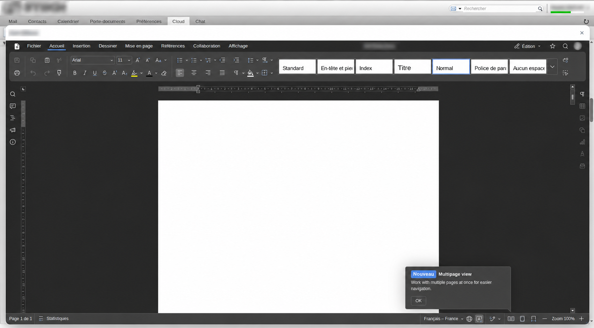

# zimbra-nextcloud-connector

> **Bêta publique — version 3.2.0-beta.7.** Cette version ajoute une interface Zimbra Classic et modifie l’installateur. Testez-la sur un serveur mailbox de préproduction avec une sauvegarde récupérable. Cloud, Talk et le menu natif **Joindre > Cloud** ont été essayés manuellement sur Zimbra FOSS 10.1.18 ; le pied fixe du sélecteur beta.7 et l’ajout effectif des pièces jointes doivent encore être validés avant de déclarer cette bêta stable. Voir [TESTING.md](TESTING.md).

`zimbra-nextcloud-connector` est une intégration communautaire indépendante des fichiers Nextcloud, de la messagerie texte Nextcloud Talk et de l’édition ONLYOFFICE ou Euro-Office dans les clients web Zimbra **Modern et Classic**.

Projet créé et maintenu par **Franck Chalon**. Il ne s’agit pas d’un produit officiel de Zimbra, Nextcloud, ONLYOFFICE ou Euro-Office.

[English documentation](README.md) · [État des tests](TESTING.md) · [Historique](CHANGELOG.md) · [Sécurité](SECURITY.md) · [Contribuer](CONTRIBUTING.md)

## Pourquoi ce projet existe

Zimbra et la communauté proposent déjà de bonnes intégrations Nextcloud. Ce projet est une option supplémentaire pour les installations qui souhaitent une seule extension serveur et une expérience commune dans Zimbra Modern et Classic, avec jusqu’à trois profils Nextcloud choisis par l’utilisateur, la gestion des fichiers, l’édition de documents et la messagerie texte Talk.

Il n’est pas présenté comme un remplacement des projets officiels Zimbra. L’administrateur doit comparer la maintenance, la compatibilité et les fonctions nécessaires avant de choisir.

| Projet | Périmètre principal | Clients Zimbra | Talk dans Zimbra | Remarques |
| --- | --- | --- | --- | --- |
| Ce projet | Fichiers, composeur, médias, bureautique et chat Talk | Modern + Classic (Classic en bêta) | Conversations texte, réponses, réactions, GIF et suppression autorisée ; aucun appel | Projet communautaire indépendant ; jusqu’à trois profils personnels |
| [Extension Nextcloud Zimbra](https://github.com/Zimbra/zm-nextcloud-extension) + [Zimlet Modern](https://github.com/Zimbra/zimbra-zimlet-nextcloud) + [annonce du paquet Classic](https://blog.zimbra.com/2023/08/introducing-new-nextcloud-zimlet-for-classic-ui/) | Intégration officielle des fichiers : pièces jointes/liens dans le composeur et enregistrement de messages ou pièces jointes vers Nextcloud | Paquets Modern + Classic ; consulter Zimbra pour la matrice exacte et la disponibilité des sources Classic | La [Zimlet Talk officielle](https://github.com/Zimbra/zimbra-zimlet-nextcloud-talk) séparée crée des réunions Talk depuis les rendez-vous Calendrier | Référence à privilégier lorsque le support et les paquets officiels sont prioritaires |
| [btactic/zimbra-drive](https://github.com/btactic/zimbra-drive) | Intégration drive Nextcloud/ownCloud | Consulter ses releases | Périmètre différent | Alternative communautaire, architecture différente |
| [btactic/owncloud-zimlet](https://github.com/btactic/owncloud-zimlet) | Zimlet liée à ownCloud/Nextcloud | Consulter sa documentation | Périmètre différent | Alternative communautaire |

Ce tableau évite volontairement toute affirmation non vérifiée de supériorité. Les fonctions évoluent : consultez les projets liés et testez la solution retenue dans votre environnement.

## Fonctionnalités

- Jusqu’à trois comptes Nextcloud par utilisateur Zimbra, par mot de passe d’application ou Login Flow v2.
- Mode facultatif de compte géré pour un service Nextcloud défini par l’administrateur.
- Profils chiffrés AES-GCM côté serveur et retrouvés dans les différentes sessions Zimbra de l’utilisateur.
- Fichiers, favoris, récents, partages et liens publics ; fil d’Ariane, recherche, tri, grille et liste.
- Envoi de fichiers/dossiers, transfert par blocs, collisions, téléchargement, ZIP, copie, déplacement, renommage, corbeille, restauration et suppression définitive.
- Création OOXML/OpenDocument et édition collaborative via le connecteur Nextcloud ONLYOFFICE ou Euro-Office correspondant.
- Détails, versions, commentaires, activité, tags, verrous, partages et liens publics en lecture seule selon les capacités du serveur.
- Aperçu des images, musiques et vidéos dans des fenêtres déplaçables et redimensionnables.
- Pièces jointes Cloud et insertion de liens publics en lecture seule dans le composeur Zimbra.
- Messagerie texte Talk : création de conversations, non-lus, brouillons, réponses, réactions, partage de fichiers, suppression selon les droits et GIF facultatifs via `integration_giphy`.
- Mini-chat rapide et espace Chat complet. Les appels audio/vidéo et la signalisation Talk sont volontairement exclus.
- Français, anglais États-Unis, espagnol Espagne/Argentine, italien, allemand, portugais Portugal/Brésil, hindi, malais et russe.

Modern et Classic partagent les mêmes composants Preact de fichiers, de sélection et de Talk. Une correction fonctionnelle n’a donc pas à être recopiée dans deux implémentations. Le code spécifique à chaque client se limite à la navigation, au pont avec le composeur et au montage dans Zimbra.

### Interface Modern

- Route Cloud native `/modern/cloud` et Chat complet `/modern/cloud/chat`.
- Bouton flottant de mini-chat dans les autres vues Modern.
- Sélecteur Cloud dans le menu des pièces jointes du composeur Modern.

Les identifiants existants `com_nextcloud_connector` et `com_nextcloud_connector_chat` sont conservés pour ne pas casser les mises à jour ni les attributions COS. Renommer une Zimlet Modern déjà déployée demande une migration explicite et ne doit pas être caché dans cette bêta.

### Interface Classic

- Deux onglets applicatifs dédiés **Cloud** et **Chat**, fournis par l’identifiant en domaine inversé `fr_franckchalon_nextcloud_classic`.
- Même espace Cloud complet et même espace Talk que Modern.
- Mini-chat global redimensionnable avec compteur non lu.
- Entrée **Cloud** dans le menu natif **Joindre** du composeur pour ajouter des fichiers et insérer des liens publics en lecture seule.

Classic est nouveau dans cette bêta. Les tests automatisés couvrent le paquet, le montage dans l’hôte, la navigation, le pont composeur et le cycle de vie du mini-chat. Il faut maintenant des rapports sur de vrais serveurs Zimbra FOSS avant d’élargir la compatibilité annoncée.

## Captures d’écran

### Interface Modern

| Navigation dans les fichiers Cloud | Ajout d’un compte Nextcloud |
|---|---|
|  |  |

| Ajout d’un fichier Cloud à un message | Éditeur collaboratif |
|---|---|
|  |  |

### Interface Classic

| Navigation dans les fichiers Cloud | Nextcloud Talk |
|---|---|
|  |  |

| Éditeur collaboratif |
|---|
|  |

## Prérequis

- Serveur mailbox Zimbra avec accès `root` et interface Modern, Classic ou les deux.
- Serveur Nextcloud HTTPS joignable depuis Zimbra, avec WebDAV et OCS.
- Nextcloud Talk (`spreed`) pour le Chat ; `integration_giphy` est facultative.
- Mot de passe d’application Nextcloud recommandé pour une connexion manuelle.
- Pour l’édition : connecteur Nextcloud ONLYOFFICE ou Euro-Office et Document Server correspondant déjà configurés.
- Routes réseau permettant à Zimbra de joindre Nextcloud et ses API bureautiques, et au Document Server de joindre les callbacks/URL de fichiers nécessaires.

La précédente version Modern a été essayée manuellement sur **Zimbra 10.1.20 GA 4893 / Ubuntu 18.04.6**, un Nextcloud réel et les deux moteurs bureautiques. Classic a été essayé sur **Zimbra FOSS 10.1.18 GA 4200001 / Ubuntu 22.04.5** pour Cloud, Talk, le mini-chat et l’ouverture du sélecteur natif **Joindre > Cloud**. Le pied fixe du sélecteur beta.7 et l’ajout effectif des pièces jointes, l’actualisation au retour sur l’onglet et la barre d’éditeur compacte ne sont pas encore certifiés. Les rapports indiquant les versions exactes sont bienvenus.

Non pris en charge : Collabora, appels audio/vidéo ou signalisation Talk, cibles HTTP publiques non chiffrées et navigateurs mobiles comme environnement certifié.

## Installation

Copiez le ZIP et sa somme depuis la même préversion GitHub vers le serveur mailbox, puis exécutez en `root` :

```bash
cd /tmp
sha256sum -c zimbra-nextcloud-connector-v3.2.0-beta.7.zip.sha256
unzip zimbra-nextcloud-connector-v3.2.0-beta.7.zip
cd zimbra-nextcloud-connector-3.2.0-beta.7
./install.sh
./diagnose.sh
```

L’installateur interactif propose :

1. Modern uniquement ;
2. Classic uniquement ;
3. Modern et Classic (choix par défaut pour un serveur mixte).

Pour une installation non interactive :

```bash
./install.sh --ui=modern
./install.sh --ui=classic
./install.sh --ui=both
CLOUD_UI_MODE=both ./install.sh
```

La présence de `--ui=...` indique déjà le choix au script : dans ce cas il ne repose volontairement pas la question. Pour ajouter ou changer les interfaces plus tard sans recompiler l’extension ni redémarrer `mailboxd` :

```bash
./configure.sh --ui=modern   # Modern uniquement
./configure.sh --ui=classic  # Classic uniquement
./configure.sh --ui=both     # conserve/installe Modern et Classic
```

Exécuté sans option, `./configure.sh` modifie d’abord les paramètres serveur puis repropose le choix des interfaces. Le mode choisi représente l’état final souhaité : utilisez `both` pour ajouter Classic tout en conservant Modern.

L’installateur compile l’extension Java contre les bibliothèques exactes du serveur, conserve la configuration et les profils chiffrés lors d’une mise à jour, ne déploie que les clients choisis et, lorsque c’est applicable, recopie les attributions COS/comptes explicites de Cloud Modern vers les paquets compagnons Chat et Classic.

Après l’installation, fermez tous les onglets Zimbra, ouvrez une nouvelle session, connectez-vous au client choisi et forcez une actualisation. Utilisez le Login Flow ou un mot de passe d’application pour la première connexion Nextcloud.

### Installation multi-mailbox

Sur un nœud mailbox supplémentaire, `--backend-only` installe/redémarre uniquement l’extension Java et ne modifie pas le déploiement LDAP des Zimlets :

```bash
./install.sh --backend-only
```

C’est une aide au déploiement, pas une certification HA globale. Aujourd’hui, les profils chiffrés et la clé maîtresse sont locaux au système de fichiers du mailbox. Les requêtes d’un utilisateur doivent atteindre un nœud qui possède l’extension, la configuration et son stockage de profils, ou ces fichiers doivent être migrés/partagés avec une stratégie sécurisée conçue par l’administrateur. Testez les déplacements de mailbox, le proxy et le basculement avant la production. Ne remplacez jamais une clé maîtresse différente au-dessus de profils déjà chiffrés.

### Plusieurs Nextcloud et multi-tenant

- **Mode personnel :** chaque utilisateur Zimbra peut connecter jusqu’à trois URL Nextcloud autorisées. Cela couvre déjà les utilisateurs ayant plusieurs serveurs.
- **Mode géré :** un seul service Nextcloud défini par l’administrateur est actuellement imposé.
- **Pas encore implémenté :** une correspondance centralisée domaine/COS → Nextcloud pour plusieurs tenants. Une conception sûre demande une table d’URL autorisées, des références de secrets plutôt que des mots de passe de service dans LDAP, un provisionnement déterministe et un comportement de migration/audit explicite. Ce ticket reste donc un chantier futur, sans raccourci dangereux.

## Diagnostic

À exécuter après installation, mise à jour et reproduction d’un problème :

```bash
cd /tmp/zimbra-nextcloud-connector-3.2.0-beta.7
./diagnose.sh
```

La dernière ligne attendue est `RESULT OK`.

Pour suivre les événements du connecteur :

```bash
tail -n 0 -F /opt/zimbra/log/mailbox.log | grep --line-buffered -iE 'NextcloudConnector|nextcloud-connector|fr\.franckchalon\.zimbra\.nextcloud'
```

Le diagnostic est en lecture seule. La console/réseau du navigateur et un test bout en bout en préproduction restent nécessaires.

## Données et sécurité

- Les secrets Nextcloud et bureautiques sont chiffrés en AES-GCM et ne sont pas renvoyés par l’API de profils.
- `/opt/zimbra/conf/nextcloud-zimlet.properties` appartient à `zimbra:zimbra` avec le mode `0600`.
- Les aperçus et téléchargements ordinaires sont diffusés sans cache de fichiers persistant dans Zimbra.
- Un fichier Cloud joint à un message devient une donnée de mailbox Zimbra et compte dans ses quotas.
- Les liens publics créés par le connecteur sont en lecture seule par défaut.
- Les cibles Nextcloud privées/loopback sont bloquées par défaut pour réduire le risque SSRF.
- Unsplash est désactivé par défaut car son activation fait contacter un tiers par le navigateur.

Ne publiez jamais configuration de production, clé maîtresse, profils chiffrés, identifiants, secrets JWT, cookies, en-têtes d’autorisation, journaux ou données clients.

## Construction depuis les sources

```bash
npm ci
npm audit --omit=dev
./build-release.sh
```

La construction compile et empaquette Modern, Classic et Java, exécute les tests automatisés, puis crée le ZIP et sa somme dans `dist/`. Les ZIP/JAR générés et `node_modules` restent hors de l’historique Git des sources.

## Publication communautaire

GitHub reste la référence pour les sources, tickets, tags et fichiers de release immuables. Publiez cette construction comme **préversion** `3.2.0-beta.7`, joignez le ZIP et son checksum correspondant, puis suivez [PUBLISHING.md](PUBLISHING.md).

## Licence

BSD-3-Clause — Copyright 2026 Franck Chalon.
